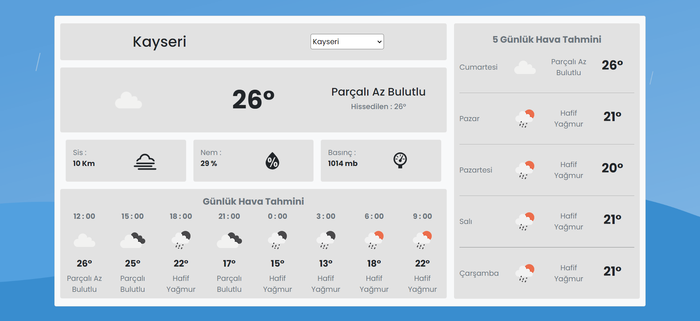

# `Weather App`
**Patika.dev** React Course Weather Application\
This React project was bootstrapped with [Vite + React + TypeScript](https://vitejs.dev)

> Support for 81 provinces in Turkey with [Turkey API](https://turkiyeapi.cyclic.app/)\
> Daily and 5 day weather information with [OpenWeather API](https://openweathermap.org/)

## `Used Technologies`
- HTML
- CSS
- Bootstrap
- JavaScript
- TypeScript
- React
    - Context API

## `Run Application`
- Create an `.env` file before starting the application
- Edit according to the contents of the `.env.local` file
  - You must use your own api key for **OpenWeather API**

Run in project directory :
````shell
npm install
````
````shell
npm run dev
````
Runs the app in the development mode.\
Open [http://localhost:3000](http://localhost:3000) to view it in the browser.

## `Preview`
